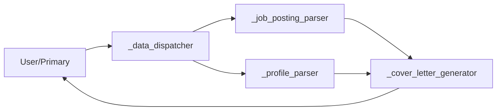

# DB Contract (Agent Storage Interface)

This document defines a **minimal, stable contract** for storage so all agents/tools can exchange data reliably.

## Terms

- **Session DB**: short-lived memory for a single run/session (cleared when the app closes).
- **Persistent DB**: long-lived memory stored under `AppData/` (survives sessions).
- **Document**: a stored unit (job posting, profile, cover letter, report, etc.).
- **Upsert**: “update-or-insert” by `id`.

## Core Objects

### `StoredDocument`

A stored record MUST have:

```json
{
  "id": "job_... | profile_... | letter_... | report_... | artifact_... | msg_... | dispatcher_db_...",
  "type": "job_posting | applicant_profile | cover_letter | report | artifact | message",
  "schema_version": 1,
  "created_at": "2026-01-21T03:12:00Z",
  "updated_at": "2026-01-21T03:12:00Z",
  "source": {
    "kind": "file | url | text | tool | chat",
    "ref": "/abs/or/rel/path-or-url-or-note",
    "hash": "sha256:...",
    "mime": "application/pdf | text/plain | application/json"
  },
  "content": { "...": "..." },
  "metadata": {
    "session_id": "optional",
    "tags": ["optional"],
    "language": "de | en",
    "company": "optional",
    "role": "optional"
  }
}
```

Notes:

- `id` must be stable and unique.
- `schema_version` allows migrations without breaking older data.
- `source.hash` enables idempotent processing (same input → same `id` if you want).

## ID Strategy (choose one)

### Option A (recommended): content-addressed IDs

- `id = <type_prefix> + sha256(normalized_source_text_or_bytes)`
- Benefits: idempotent, avoids duplicates

Examples:

- `job_8f2c...` (from job posting text)
- `profile_19ad...`

### Option B: UUID IDs

- `id = uuid4()`
- Benefits: simplest
- Drawback: duplicates possible unless you additionally dedupe by `source.hash`

## Operations (Contract)

All DB operations should return a consistent envelope.

### Common Response Envelope

Success:

```json
{ "ok": true, "result": { "...": "..." } }
```

Error:

```json
{ "ok": false, "error": "Human-readable message", "hints": ["optional"] }
```

### `upsert`

Store or update a document by `id`.

Request:

```json
{ "op": "upsert", "doc": { "id": "...", "type": "...", "content": { } } }
```

Response:

```json
{ "ok": true, "result": { "id": "...", "created": true, "updated": false } }
```

Rules:

- If `id` does not exist: insert and return `created=true`.
- If `id` exists: replace/merge content and return `updated=true`.

### `fetch`

Request:

```json
{ "op": "fetch", "id": "job_..." }
```

Response:

```json
{ "ok": true, "result": { "doc": { "id": "...", "type": "...", "content": { } } } }
```

### `query` (vector / semantic)

Request:

```json
{ "op": "query", "query": "cuda init", "k": 5, "filters": { "type": "job_posting" } }
```

Response (recommendation): return a ranked list of hits.

```json
{
  "ok": true,
  "result": {
    "hits": [
      {
        "rank": 1,
        "score": 0.82,
        "id": "job_...",
        "title": "optional",
        "content": "short snippet",
        "metadata": { "source": "..." }
      }
    ]
  }
}
```

### `list` (admin/debug)

Request:

```json
{ "op": "list", "filters": { "type": "cover_letter" }, "limit": 50 }
```

Response:

```json
{ "ok": true, "result": { "items": [{ "id": "...", "type": "...", "updated_at": "..." }] } }
```

## Domain Schemas (minimal)

### `job_posting.content`

```json
{
  "title": "...",
  "company": "...",
  "location": "...",
  "employment_type": "full-time | part-time | contract | internship | unknown",
  "requirements": ["..."],
  "responsibilities": ["..."],
  "keywords": ["python", "qt", "rag"],
  "raw_text": "optional"
}
```

### `applicant_profile.content`

```json
{
  "name": "optional",
  "headline": "...",
  "skills": ["python", "pyside6"],
  "experience": [{ "company": "...", "role": "...", "highlights": ["..."] }],
  "projects": [{ "name": "...", "stack": ["..."], "impact": "..." }],
  "raw_text": "optional"
}
```

### `cover_letter.content`

```json
{
  "language": "de",
  "tone": "professional",
  "job_posting_id": "job_...",
  "profile_id": "profile_...",
  "body_markdown": "...",
  "claims": [
    { "claim": "Built Qt6/PySide6 tooling", "evidence": ["project: ai_ide"] }
  ]
}
```

## Where this maps in your repo

- Persistent vector operations: `vdb_worker`, `vectordb`.
- Session retrieval: `memorydb`.
- File output: `write_document`.

## Mapping to your current VectorDB (LangChain `Document`)

Your persistent vector store is implemented with LangChain + FAISS. The atomic record is:

```python
Document(
  page_content=content_str,
  metadata={
    "source": "...",        # used for dedupe/manifest
    "titel": "...",         # filename
    "id": "sha256:...",     # stable ID (recommended)
    # --- JSON chat-history specific ---
    "source-key": "sha256:...",  # stable per-message key
        "language": "de",
    "role": "user|assistant|tool",
    "message-id": "...",
    "thread-id": "...",
    "time": "...",
    "date": "...",
    "index": 0,
    # optional: store embeddings in metadata only if enabled
    "vector": [0.1, 0.2, ...] | None,
  }
)
```

Important:

- Python’s built-in `hash()` is **not stable across runs** (hash randomization). For IDs, prefer `sha256`.
- Storing vectors in `metadata["vector"]` should be **optional** (large + slow). In your code this is gated by `AI_IDE_STORE_JSON_VECTORS_IN_METADATA=1`.

If you want, I can adapt this contract to your existing `VectorStore` manifest format (e.g., `AppData/VSM_*_Data/manifest.json`) so the schema matches what you already persist.

## VectorStore Manifest Contract (matches current persistence)

Your current persistent VectorStore layout is a directory:

`AppData/VSM_<store>_Data/`

with these primary files:

- `index.faiss` (FAISS index)
- `index.pkl` (LangChain/FAISS docstore + metadata)
- `manifest.json` (incremental-build manifest; **dedupe list**)

### `manifest.json` (current format)

The manifest file is a **JSON array of strings**:

```json
[
  "/abs/path/to/file1.pdf",
  "/abs/path/to/file2.md",
  "{\"some\": \"json-dumped-source\"}"
]
```

Semantics:

- Each entry represents a `Document.metadata["source"]` value that has already been indexed.
- The system treats this list as a **set** (unique membership check) to enable incremental builds:
  - `build()` only indexes documents whose `metadata["source"]` is not present in the manifest.
  - After indexing, it appends those new `source` values and writes the manifest back.

Normalization rule (important):

- `metadata["source"]` is normalized to a string before it is compared/added.
  - If it is already a string, it is used as-is.
  - If it is a dict/list/tuple, it is JSON-serialized (sorted keys) to become a stable string.

Write behavior:

- The manifest is written as a sorted list of strings (`ensure_ascii=false`, `indent=2`).

Compatibility notes:

- Older manifests may contain numeric-looking strings (e.g., legacy `hash()` artifacts). They are still loadable because entries are normalized to `str`, but they are not meaningful paths.
- If the manifest contains junk entries, the recommended recovery is `wipe/reset` the store (delete index + manifest) and rebuild.

### How this manifest relates to the higher-level contract

The manifest is **not** the `StoredDocument` database. It is a lightweight “already indexed sources” registry.

Mapping:

- `StoredDocument.source.ref` ↔ `Document.metadata["source"]` ↔ an entry in `manifest.json`
- `StoredDocument.id` ↔ `Document.metadata["id"]` (recommended to be stable, e.g. `sha256:...`)
- The manifest does *not* store `id`, timestamps, type, tags, or content; those live in the LangChain docstore (`index.pkl`) and/or your higher-level artifacts.

### Recommended manifest v2 (optional, future-proof)

If you ever want the manifest to carry more structured info while keeping backward compatibility, a safe upgrade path is:

```json
{
  "schema_version": 2,
  "items": [
    {
      "source": "/abs/path/to/file.pdf",
      "source_hash": "sha256:...",
      "doc_id": "sha256:...",
      "added_at": "2026-01-21T03:12:00Z"
    }
  ]
}
```

Rule: loaders should accept either the current v1 list-of-strings or the v2 object format.

---

## Agent Workflow Integration

### Agent Flow Overview



**Sequence:**
1. User/Primary → `_data_dispatcher` (scans PDFs, checks DB)
2. `_data_dispatcher` → `_job_posting_parser` (forwards unprocessed files)
3. `_data_dispatcher` → `_profile_parser` (if needed)
4. `_job_posting_parser` → `_cover_letter_generator` (structured job data)
5. `_profile_parser` → (stored profile, reused)
6. `_cover_letter_generator` → User (final cover letter)

### Dispatcher → Parser Payload Mapping

When `_data_dispatcher` calls `dispatch_files` and forwards to `_job_posting_parser`, the payload structure is:

```json
{
  "type": "job_posting_pdf",
  "correlation_id": "<content_sha256>",
  "link": {
    "thread_id": "<THREAD_ID>",
    "message_id": "<MESSAGE_ID>"
  },
  "file": {
    "path": "/abs/path/to/file.pdf",
    "name": "file.pdf",
    "content_sha256": "<sha256>",
    "file_size_bytes": 12345,
    "mtime_epoch": 1730000000,
    "content": "<extracted plain text (optional but preferred)>"
  },
  "db": {
    "existing_record_id": "<ID_OR_NULL>",
    "processing_state": "queued|new|processing|failed|processed"
  },
  "requested_actions": [
    "parse",
    "extract_text",
    "store_job_posting",
    "mark_processed_on_success"
  ]
}
```

**Mapping to `StoredDocument`:**

| Dispatcher Field | StoredDocument Field | Notes |
|-----------------|---------------------|-------|
| `correlation_id` | `id` prefix | Used to generate stable `job_<sha256>` ID |
| `file.path` | `source.ref` | Absolute file path |
| `file.content_sha256` | `source.hash` | `sha256:...` format |
| `file.content` | Used for parsing, then stored in `content.raw_text` | Optional in payload, required for parsing |
| `type: "job_posting_pdf"` | `type: "job_posting"` | Normalized type |
| `db.processing_state` | Internal dispatcher DB state | Not part of `StoredDocument` |

### Parser → StoredDocument Transformation

The `_job_posting_parser` transforms the dispatcher payload into a `StoredDocument`:

```json
{
  "id": "job_<content_sha256>",
  "type": "job_posting",
  "schema_version": 1,
  "created_at": "2026-01-21T10:30:00Z",
  "updated_at": "2026-01-21T10:30:00Z",
  "source": {
    "kind": "file",
    "ref": "/abs/path/to/file.pdf",
    "hash": "sha256:<content_sha256>",
    "mime": "application/pdf"
  },
  "content": {
    "title": "Senior Python Developer",
    "company": "TechCorp GmbH",
    "location": "Berlin, Germany",
    "employment_type": "full-time",
    "requirements": ["Python", "FastAPI", "PostgreSQL"],
    "responsibilities": ["Build APIs", "Mentor team"],
    "keywords": ["python", "fastapi", "postgresql", "backend"],
    "raw_text": "<full extracted text>"
  },
  "metadata": {
    "language": "de",
    "company": "TechCorp GmbH",
    "role": "Senior Python Developer"
  }
}
```

### Profile Parser Input → StoredDocument

For `_profile_parser`:

**Input (variant A - text):**
```json
{
  "type": "applicant_profile_text",
  "correlation_id": "<optional>",
  "text": "<CV content>",
  "defaults": {
    "language": "de",
    "tone": "modern",
    "max_length": 350
  }
}
```

**Input (variant B - file):**
```json
{
  "type": "applicant_profile_file",
  "correlation_id": "<file.content_sha256>",
  "file": {
    "path": "/abs/path/to/cv.pdf",
    "name": "cv.pdf",
    "content_sha256": "<sha256>",
    "content": "<extracted text (optional)>"
  },
  "defaults": {
    "language": "de",
    "tone": "modern",
    "max_length": 350
  }
}
```

**Output → StoredDocument:**
```json
{
  "id": "profile_<sha256(email)>",
  "type": "applicant_profile",
  "schema_version": 1,
  "created_at": "2026-01-21T10:30:00Z",
  "updated_at": "2026-01-21T10:30:00Z",
  "source": {
    "kind": "file",
    "ref": "/abs/path/to/cv.pdf",
    "hash": "sha256:<content_sha256>",
    "mime": "application/pdf"
  },
  "content": {
    "name": "Max Mustermann",
    "headline": "Senior Software Engineer",
    "skills": ["Python", "PySide6", "FastAPI"],
    "experience": [
      {
        "company": "ACME Corp",
        "role": "Backend Developer",
        "highlights": ["Built RAG system", "Deployed on AWS"]
      }
    ],
    "projects": [
      {
        "name": "AI IDE",
        "stack": ["Python", "Qt6"],
        "impact": "Productivity tool for developers"
      }
    ],
    "raw_text": "<CV full text>"
  },
  "metadata": {
    "language": "de",
    "tone": "modern"
  }
}
```

### Cover Letter Generator Flow

**Input from workflow:**
```json
{
  "job_posting_result": {
    "agent": "_job_posting_parser",
    "correlation_id": "<job_sha256>",
    "job_posting": { /* structured job data */ },
    "parse": { "language": "de", "extraction_quality": "high" }
  },
  "profile_result": {
    "agent": "_profile_parser",
    "correlation_id": "<profile_correlation>",
    "profile": { /* structured profile */ },
    "parse": { "language": "de", "extraction_quality": "high" }
  },
  "options": {
    "language": "de",
    "tone": "modern",
    "max_words": 350,
    "date": null,
    "city": null,
    "include_enclosures": true
  }
}
```

**Output → StoredDocument:**
```json
{
  "id": "letter_<uuid|sha256>",
  "type": "cover_letter",
  "schema_version": 1,
  "created_at": "2026-01-21T10:35:00Z",
  "updated_at": "2026-01-21T10:35:00Z",
  "source": {
    "kind": "tool",
    "ref": "_cover_letter_generator",
    "hash": "sha256:<input_payload_hash>",
    "mime": "application/json"
  },
  "content": {
    "language": "de",
    "tone": "modern",
    "job_posting_id": "job_<sha256>",
    "profile_id": "profile_<sha256>",
    "body_markdown": "Sehr geehrte Damen und Herren,\n\n...",
    "full_text": "<complete cover letter>",
    "word_count": 342,
    "matched_requirements": ["Python", "FastAPI", "Team leadership"],
    "highlighted_skills": ["Python", "PySide6", "API development"],
    "red_flags": [],
    "claims": [
      {
        "claim": "Built Qt6/PySide6 tooling",
        "evidence": ["project: ai_ide"]
      },
      {
        "claim": "5+ years Python experience",
        "evidence": ["experience: ACME Corp"]
      }
    ]
  },
  "metadata": {
    "language": "de",
    "company": "TechCorp GmbH",
    "role": "Senior Python Developer",
    "job_posting_id": "job_<sha256>",
    "profile_id": "profile_<sha256>"
  }
}
```

### Correlation ID Flow

The `correlation_id` is used throughout the workflow for traceability:

1. **Dispatcher**: `correlation_id = file.content_sha256`
2. **Job Posting Parser**: Receives `correlation_id`, generates `id = "job_" + correlation_id`
3. **Profile Parser**: `correlation_id = sha256(email)` or `file.content_sha256`
4. **Cover Letter Generator**: Receives both correlation IDs, generates new `id = "letter_" + uuid()`

### Processing State Transitions

Dispatcher DB tracks processing state separately from `StoredDocument`:

```
new → queued → processing → processed
                         ↘ failed
```

- `new`: File discovered, not yet queued
- `queued`: Sent to parser, awaiting processing
- `processing`: Parser is working on it
- `processed`: Successfully parsed and stored in persistent DB
- `failed`: Parse error or validation failure

**Important**: The dispatcher DB (`dispatcher_doc_db.json`) is a lightweight tracking layer. The actual parsed content lives in `StoredDocument` records in the persistent DB.

### Tool References

| Agent | Primary Tools |
|-------|--------------|
| `_data_dispatcher` | `dispatch_files`, `load_dispatcher_db`, `save_dispatcher_db`, `route_to_agent` |
| `_job_posting_parser` | `load_dispatcher_db`, `save_dispatcher_db`, `route_to_agent` |
| `_profile_parser` | (text extraction, no special tools) |
| `_cover_letter_generator` | `memorydb`, `vectordb`, `write_document` |

---

## Updated Tool: `dispatch_files`

Formerly `dispatch_job_posting_pdfs`. Now supports multiple file types and optional content extraction.

**Function Signature:**
```python
def dispatch_files(
    scan_dir: str,
    db_path: str | None = None,
    thread_id: str | None = None,
    dispatcher_message_id: str | None = None,
    recursive: bool = True,
    extensions: list | None = None,
    max_files: int | None = None,
    parser_agent_name: str = "_job_posting_parser",
    dry_run: bool = False,
    extract_content: bool = True,
) -> dict:
```

**New Parameter:**
- `extract_content` (bool, default: `true`): If true, attempts to extract plain text from PDFs and include it in the `file.content` field of the handoff payload.

**Output:**
```json
{
  "agent": "data_dispatcher",
  "scan_dir": "/path",
  "timestamp": "2026-01-21T10:30:00Z",
  "db": {
    "path": "/path/to/dispatcher_doc_db.json",
    "reachable": true
  },
  "summary": {
    "pdf_found": 12,
    "new": 2,
    "known_unprocessed": 1,
    "known_processing": 3,
    "known_processed": 6,
    "errors": 0
  },
  "forwarded": [
    {
      "path": "/path/file.pdf",
      "content_sha256": "...",
      "link": {
        "thread_id": "...",
        "message_id": "PENDING"
      }
    }
  ],
  "handoff_messages": [
    {
      "target_agent": "_job_posting_parser",
      "message_text": { /* JSON object, not string */ },
      "correlation_id": "...",
      "dispatcher_message_id": "..."
    }
  ],
  "errors": []
}
```

**Key Changes:**
1. Renamed from `dispatch_job_posting_pdfs` to `dispatch_files`
2. Added `extract_content` parameter for optional PDF text extraction
3. Payload now includes `file.content` field with extracted text
4. `handoff_messages[].message_text` is now a JSON object (not a string)
5. Default `parser_agent_name` changed from `"data_parser"` to `"_job_posting_parser"`

---

**Contract Version**: 2.0  
**Last updated**: 21 January 2026
