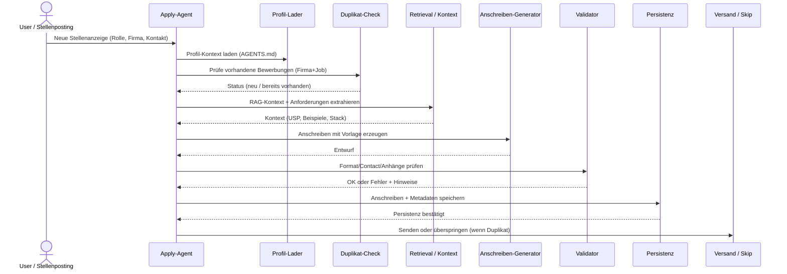
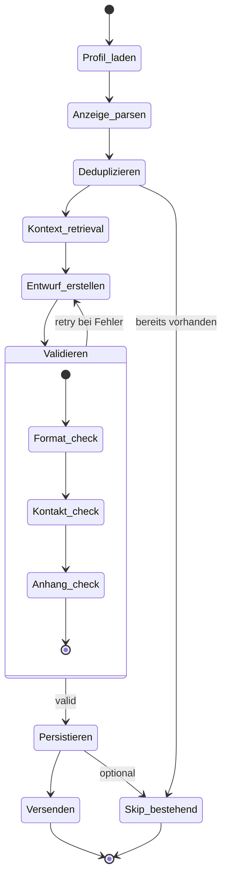
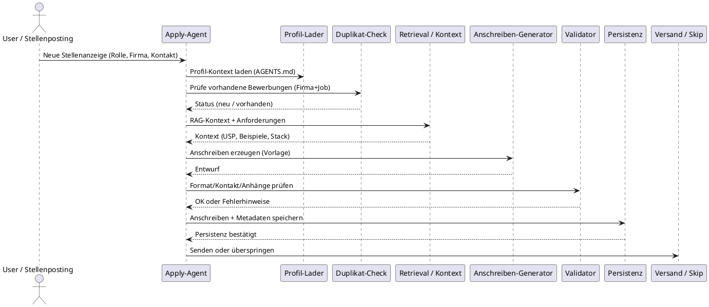
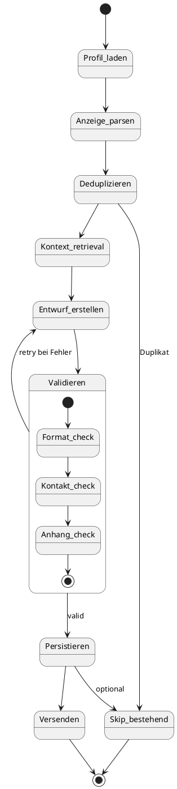
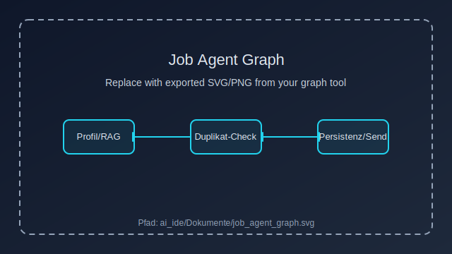

# Apply Agent – Ausführungsleitfaden

## Ziel
Bewerbungen automatisiert erstellen, deduplizieren, validieren und mit Metadaten im Vektor-Store ablegen.

## Pflicht-Ressourcen
- Profilquelle: AGENTS.md (per Retrieval/Tool-Aufruf relevante Passagen ziehen).
- Anhänge: /lebenslauf.pdf, /zeugnisse.pdf, /portfolio.pdf.
- Vorlagen: Muster-Anschreiben je Job-Typ (z.B. Anwendungsentwickler).

## Workflow (Checkliste)
1. **Kontext laden**
   - RAG/Tool: relevante Passagen aus AGENTS.md abfragen.
   - Stellenanzeige parsen (Titel, Firma, Ansprechpartner, E-Mail, Anforderungen).
2. **Deduplizieren**
   - Vektor-Store prüfen auf gleiche Firma + Jobtitel (+ optional Datum ≤30 Tage).
3. **Analyse der Anzeige**
   - Muss-/Kann-Kriterien, Tech-Stack, Kernanforderungen extrahieren.
4. **Anschreiben generieren**
   - Vorlage nach Job-Typ wählen.
   - Platzhalter füllen: {Firma}, {JobTitel}, {Ansprechpartner}, {Datum}, {USP}, {Beispiele}, {CallToAction}.
5. **Validieren**
   - Sprache/Format prüfen (Deutsch, höflich), Kontakte korrekt, Anhänge referenziert.
6. **Persistieren**
   - Anschreiben + Metadaten im Vektor-Store ablegen (Schema unten).
   - Bewerbung als erledigt markieren (für spätere Deduplikation).
7. **Anhänge referenzieren**
   - Pfade der Anhänge im Datensatz hinterlegen.

## Ablauf – Sequenzdiagramm (Mermaid)


## Zustände – State/Flow (Mermaid)


## UML (PlantUML) – Sequenz & Zustände
### Sequenz (PlantUML)


### Zustände (PlantUML)


## Persistenz-Schema (Beispiel, JSON)
```json
{
  "firma": "Example GmbH",
  "job_titel": "Anwendungsentwickler",
  "email": "hr@example.com",
  "ansprechpartner": "Frau Muster",
  "source_url": "https://example.com/jobs/123",
  "generiert_am": "2025-04-21T10:00:00Z",
  "sprache": "de",
  "anschreiben": "Sehr geehrte ...",
  "quellen": ["AGENTS.md", "Stellenanzeige_123.pdf"],
  "anhaenge": ["/lebenslauf.pdf", "/zeugnisse.pdf", "/portfolio.pdf"],
  "vector_ref": "AppData/index.faiss#example-gmbh-anwendungsentwickler",
  "status": "gesendet",
  "hash_key": "example-gmbh|anwendungsentwickler|2025-04",
  "notizen": "Kontakt bestätigt, Versand per E-Mail"
}
```

## Auto-Generated Graphs (LangGraph-Style Platzhalter)
- Aktuelles Export-Asset hier einbinden: `ai_ide/Dokumente/job_agent_graph.svg` (oder `.png`).
- Zum Aktualisieren einfach die Datei ersetzen; Einbindung bleibt konstant.
- Beispiel-Einbettung:



## Preview/Update Hinweise
- Mermaid rendert nativ in GitHub und in VS Code (Markdown Preview, Mermaid-Erweiterung optional).
- Bei neuem Graph-Export nur die Datei unter `ai_ide/Dokumente/job_agent_graph.svg` ersetzen.
- Für andere Formate (png) den Dateinamen in der Einbettung anpassen.